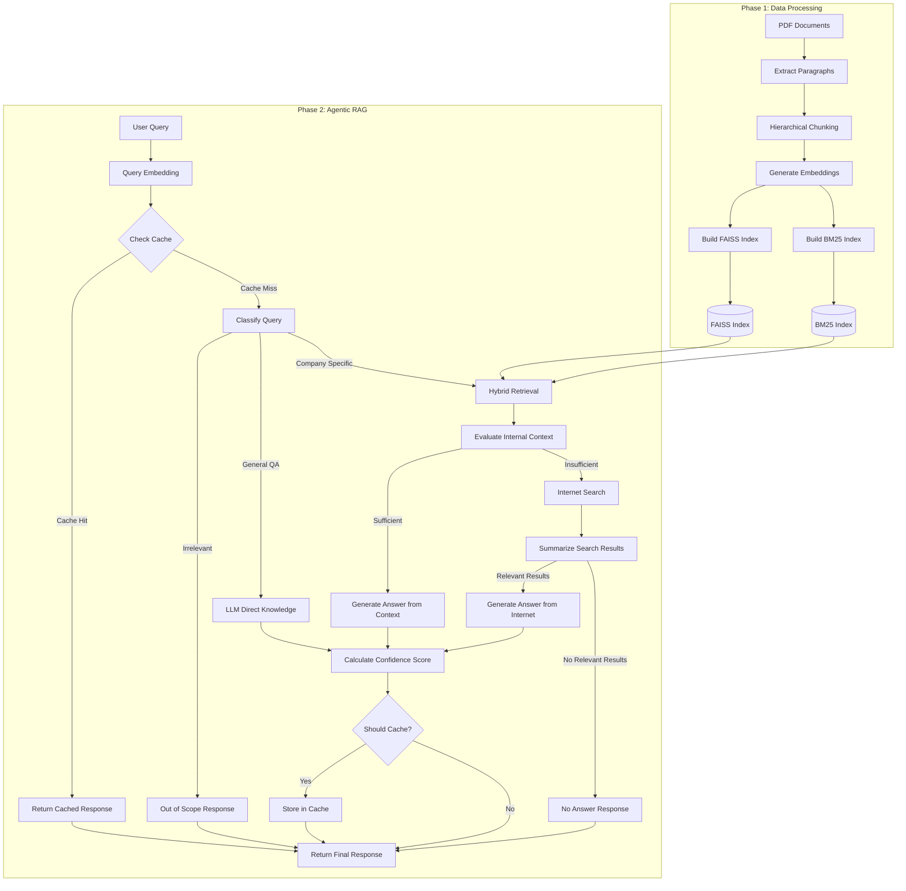

# Architecture Analysis Report

## Summary
This codebase implements an Agentic Retrieval-Augmented Generation (RAG) system with a two-phase architecture:
- **Phase 1**: Data ingestion, document chunking, embedding generation, and hybrid index building (FAISS + BM25)
- **Phase 2**: Query processing with agent-based decision making, multi-path answer generation, confidence scoring, and Redis-based caching

The architecture follows a modular design with clear separation of concerns between data processing, retrieval, and generation components. It implements an intelligent agent pattern that makes decisions about how to handle different types of queries.

## Entry Points
- `Phase-1/phase1_build.py:main` → Entry point for data ingestion and index building
- `agentic_rag_phase2.py:main` → Entry point for the query processing system

## Architectural Style
- **Agent-based architecture** with a decision-making component that routes queries to appropriate handlers
- **Pipeline architecture** for Phase 1 data processing
- **Layered architecture** for Phase 2 with clear separation between:
  - Query classification layer
  - Retrieval layer
  - Answer generation layer
  - Caching layer

## Architecture Diagram

## Component Responsibilities

### Phase 1: Data Processing
1. **PDF Extraction**: Extracts text from PDF documents
2. **Hierarchical Chunking**: Splits documents into paragraph-level chunks with smart handling of large paragraphs
3. **Embedding Generation**: Creates vector embeddings for chunks using Gemini's text-embedding-004 model
4. **Index Building**: Creates both dense (FAISS) and sparse (BM25) indexes for hybrid retrieval

### Phase 2: Agentic RAG
1. **Query Classification Agent**: Determines if a query is:
   - Irrelevant (outside company policy scope)
   - General QA (answerable with LLM knowledge)
   - Company-specific (requires internal documents)

2. **Retrieval System**: 
   - Hybrid retrieval combining FAISS (semantic) and BM25 (keyword) search
   - Optimized for paragraph-level chunks

3. **Answer Generation Components**:
   - Internal Context Evaluation: Determines if retrieved chunks contain the answer
   - Internet Search Fallback: Uses Serper API to search the web when internal docs are insufficient
   - LLM-based Answer Generation: Constructs answers from retrieved context

4. **Confidence Scoring**: Calculates confidence in generated answers based on:
   - Query-answer semantic similarity
   - Retrieval quality metrics

5. **Caching Layer**: 
   - Redis-based vector similarity caching
   - Stores and retrieves answers for semantically similar queries

## Data Flow

1. User submits a query
2. System checks cache for similar previous queries
3. If cache miss, query is classified by the agent
4. Based on classification, system follows one of three paths:
   - Irrelevant → Rejection response
   - General QA → Direct LLM answer
   - Company-specific → Internal document retrieval
5. For company-specific queries:
   - System performs hybrid retrieval from indexes
   - Evaluates if retrieved context contains the answer
   - If insufficient, falls back to internet search
6. System generates answer with appropriate citations
7. Confidence score is calculated
8. High-confidence answers are stored in cache
9. Final answer is returned to user

## Technical Implementation Details

- **Embedding Model**: Google's Gemini text-embedding-004 (768-dimensional vectors)
- **LLM**: Gemini-2.0-flash for classification and generation tasks
- **Retrieval**: Hybrid approach combining FAISS (dense) and BM25 (sparse) retrieval
- **Caching**: Redis with RediSearch for vector similarity-based caching
- **External APIs**: 
  - Gemini API for embeddings and LLM
  - Serper API for internet search

## Notable Design Patterns

1. **Agent Pattern**: Decision-making agent for query routing
2. **Pipeline Pattern**: Sequential processing in Phase 1
3. **Fallback Pattern**: Graceful degradation from internal to internet search
4. **Caching Pattern**: Vector similarity-based caching for performance
5. **Retry Pattern**: Robust error handling with retries for API calls

## Strengths and Limitations

### Strengths
- Modular architecture with clear separation of concerns
- Multiple answer paths based on query type
- Hybrid retrieval combining semantic and keyword search
- Confidence scoring for answer quality assessment
- Vector similarity caching for performance optimization

### Limitations
- Single-pass RAG (no iterative refinement)
- Limited to text content (no multimodal support)
- Synchronous processing model (no async/parallel execution)
- Dependent on external APIs for core functionality