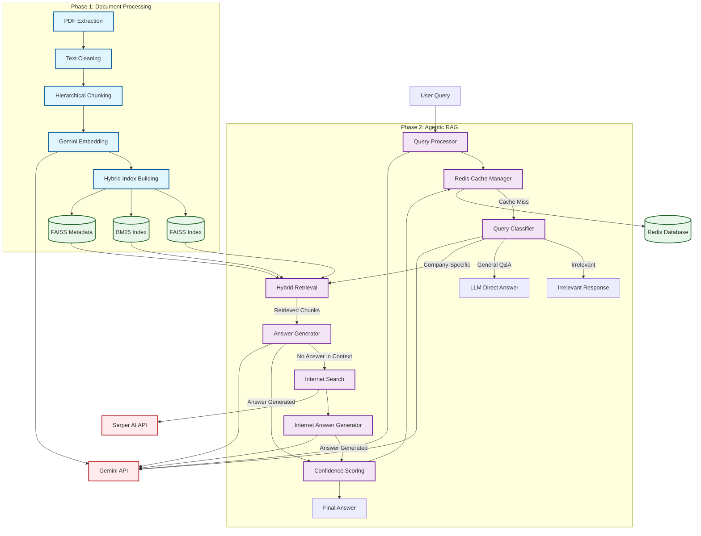

# Architecture Analysis Report

## Summary
The codebase implements an Agentic Retrieval-Augmented Generation (RAG) system split across two phases. Phase 1 handles document ingestion, chunking, embedding, and index building, while Phase 2 implements the intelligent agent that processes user queries, performs retrieval, and generates answers. The architecture follows a layered approach with clear separation of concerns between data processing, retrieval, and generation components. The system incorporates multiple data sources (internal documents and internet search), caching mechanisms, and confidence scoring for generated answers.

## Entry Points
- `Phase-1/phase1_build.py:main` → CLI entry point for document processing and index building
- `agentic_rag_phase2.py:main` → CLI entry point for query processing and answering

## Architectural Style
The system follows a modular, pipeline-based architecture with the following key components:

1. **Document Processing Pipeline** (Phase 1):
   - PDF extraction and cleaning
   - Hierarchical paragraph-level chunking
   - Embedding generation using Gemini API
   - Hybrid index building (FAISS + BM25)

2. **Agentic RAG Pipeline** (Phase 2):
   - Query classification (Irrelevant, General Q&A, Company-Specific)
   - Hybrid retrieval from internal documents
   - Context-based answer generation
   - Internet search fallback
   - Confidence scoring
   - Redis-based caching

The architecture demonstrates a clear separation between the data processing layer (Phase 1) and the intelligent agent layer (Phase 2), with shared artifacts (indexes) connecting them.

## Architecture Diagram



## UI/Backend Violations
- No UI/backend violations were identified as this is a purely backend system with a simple CLI interface.

## Details

### Phase 1: Document Processing

The Phase 1 architecture is implemented in `phase1_build.py` and focuses on document processing and index building. Key components include:

1. **PDF Extraction and Cleaning**:
   ```python
   def extract_paragraphs(pdf_path: str) -> list[dict]:
       # Extracts text from PDFs and cleans it
   ```

2. **Hierarchical Chunking**:
   ```python
   def hierarchical_chunking(blocks: list[dict]) -> list[dict]:
       # Implements paragraph-level chunking with sentence boundary preservation
   ```

3. **Embedding Generation**:
   ```python
   def get_gemini_embeddings_batch(texts: list[str], task_type: str) -> list[list[float]]:
       # Generates embeddings using Gemini API with batching and retry logic
   ```

4. **Hybrid Index Building**:
   ```python
   def build_hybrid_index(chunks: list[dict]):
       # Builds FAISS vector index and BM25 sparse index
   ```

### Phase 2: Agentic RAG

The Phase 2 architecture is implemented in `agentic_rag_phase2.py` and orchestrates the intelligent agent for query processing. Key components include:

1. **Query Classification**:
   ```python
   def classify_query(query: str) -> str:
       # Determines if query is Irrelevant, General Q&A, or Company-Specific
   ```

2. **Hybrid Retrieval**:
   ```python
   def hybrid_retrieval(query: str, faiss_index, faiss_metadata: dict, bm25_index, top_k: int = 5, alpha: float = 0.7) -> list[dict]:
       # Performs hybrid dense-sparse retrieval from internal document indexes
   ```

3. **Answer Generation**:
   ```python
   def evaluate_and_answer(query: str, retrieved_chunks: list[dict]):
       # Generates answers from internal context or signals insufficient context
   ```

4. **Internet Search Fallback**:
   ```python
   def perform_internet_search(query: str, num_results: int = 5) -> list[dict]:
       # Performs internet search using Serper AI when internal documents are insufficient
   ```

5. **Confidence Scoring**:
   ```python
   def calculate_confidence_score(query_embedding: np.ndarray, answer_text: str, retrieved_chunks: list[dict], path_taken: str, raw_query: str) -> float:
       # Calculates confidence score for generated answers
   ```

6. **Redis Caching Layer**:
   ```python
   class RedisCacheManager:
       # Manages vector similarity-based caching of query-answer pairs
   ```

7. **Orchestration**:
   ```python
   def answer_query_agentic_with_cache(query: str, faiss_index, faiss_metadata: dict, bm25_index, cache_manager: RedisCacheManager) -> dict:
       # Main orchestration function that coordinates the entire agent pipeline
   ```

### External Dependencies

The system relies on several external services and libraries:

1. **Gemini API**: Used for:
   - Text embeddings (models/text-embedding-004)
   - LLM-based query classification (gemini-2.0-flash)
   - Answer generation from context
   - Internet search result summarization

2. **Serper AI**: Used for internet search when internal documents are insufficient

3. **Redis with RediSearch**: Used for vector similarity-based caching of query-answer pairs

4. **FAISS**: Used for efficient vector search of document chunks

5. **BM25Okapi**: Used for sparse keyword-based retrieval

### Data Flow

1. User submits a query through the CLI
2. System checks Redis cache for similar previous queries
3. If cache miss, query is classified (Irrelevant, General Q&A, Company-Specific)
4. For Company-Specific queries:
   - System retrieves relevant chunks from internal documents using hybrid retrieval
   - LLM generates an answer from retrieved context or signals insufficient context
   - If context is insufficient, system performs internet search as fallback
5. System calculates confidence score for the generated answer
6. Answer is stored in Redis cache if confidence exceeds threshold
7. Final answer with sources and confidence score is returned to user

The architecture demonstrates a well-designed pipeline with clear separation of concerns, effective use of external services, and intelligent fallback mechanisms to ensure high-quality answers.