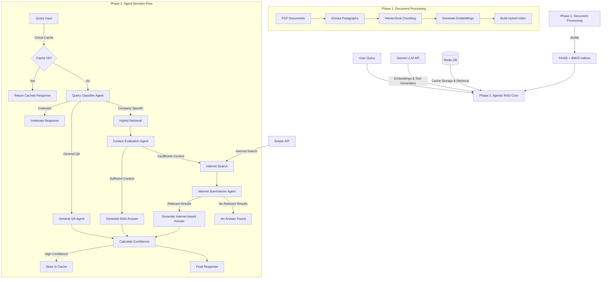

# Architecture Analysis Report

## Summary
This codebase implements a sophisticated Agentic RAG (Retrieval-Augmented Generation) system with a two-phase architecture. Phase 1 handles document ingestion, processing, and indexing, while Phase 2 implements the core query processing logic with intelligent decision-making capabilities. The system uses a hybrid retrieval approach combining dense (FAISS) and sparse (BM25) search, integrates with Gemini LLM for various tasks, and includes a Redis-based caching layer. The architecture follows a clean separation of concerns with distinct modules for document processing, retrieval, agent decision-making, and caching.

## Entry Points
- `phase1_build.py:main` → CLI entry point for Phase 1 (document processing and index building)
  - Flags: `--build` to build indices, `--query` for testing retrieval
- `agentic_rag_phase2.py:main` → CLI entry point for Phase 2 (agent-based query processing)
  - Flags: `--query` for interactive query mode

## Architectural Style
- **Pipeline Architecture**: The system follows a clear pipeline architecture with distinct processing stages:
  1. Document processing (PDF extraction, cleaning)
  2. Chunking (hierarchical paragraph-level)
  3. Embedding generation
  4. Index building (FAISS + BM25)
  5. Query processing with agent-based decision making
  6. Multi-path answer generation (internal RAG, internet search, general knowledge)
  7. Confidence scoring
  8. Caching

- **Agent-based Architecture**: The system employs multiple specialized agents:
  1. Query Classifier Agent: Determines if a query is irrelevant, general Q&A, or company-specific
  2. Context Evaluation Agent: Evaluates if internal context can answer a question
  3. Internet Search Summarizer Agent: Synthesizes internet search results

## UI/Backend Violations
- No UI/Backend violations found. The system is entirely backend-focused with a simple CLI interface.
- The code maintains a clean separation of concerns between data processing, retrieval logic, and user interaction.

## Architecture Diagram

## Details

### Phase 1: Document Processing & Indexing

Phase 1 handles document ingestion, processing, and index building:

1. **Document Extraction**:
   - `extract_paragraphs()` uses PyMuPDF (fitz) to extract text from PDF documents
   - Cleans text by removing page numbers and other artifacts
   - Splits text into paragraphs based on double newlines

2. **Chunking**:
   - `hierarchical_chunking()` implements paragraph-level chunking
   - Small paragraphs are kept as single chunks
   - Large paragraphs are split at sentence boundaries to keep chunks under a token limit

3. **Embedding Generation**:
   - `get_gemini_embeddings_batch()` generates embeddings using Gemini's text-embedding-004 model
   - Includes batching, retry logic, and error handling

4. **Index Building**:
   - `build_hybrid_index()` builds two complementary indices:
     - FAISS index for dense vector search
     - BM25 index for sparse keyword search
   - Stores metadata separately for retrieval

5. **Retrieval**:
   - `hybrid_retrieval()` combines results from both indices with a weighted scoring mechanism

### Phase 2: Agentic RAG Core

Phase 2 implements the intelligent decision-making agent:

1. **Cache Management**:
   - `RedisCacheManager` class handles vector-similarity-based caching using Redis
   - Stores and retrieves answers for similar previous queries

2. **Query Classification**:
   - `classify_query()` determines if a query is irrelevant, general Q&A, or company-specific
   - Uses Gemini LLM with a specialized prompt

3. **Context Evaluation**:
   - `evaluate_and_answer()` determines if retrieved chunks contain sufficient information
   - Generates answers with citations when possible

4. **Internet Search**:
   - `perform_internet_search()` queries Serper API for web results
   - `summarize_search_results()` uses LLM to extract relevant information

5. **Confidence Scoring**:
   - `calculate_confidence_score()` determines the reliability of generated answers
   - Considers semantic similarity and retrieval quality

6. **Main Orchestration**:
   - `answer_query_agentic()` orchestrates the entire query processing flow
   - `answer_query_agentic_with_cache()` adds caching layer on top

### Key Design Patterns

1. **Pipeline Pattern**: Sequential processing of documents and queries through well-defined stages
2. **Strategy Pattern**: Different answering strategies based on query classification
3. **Adapter Pattern**: Consistent interfaces for different embedding and retrieval mechanisms
4. **Proxy Pattern**: Cache acts as a proxy for the full query processing pipeline
5. **Command Pattern**: CLI arguments determine execution flow

### Data Flow

1. User submits query via CLI
2. System checks cache for similar previous queries
3. If cache miss, query is classified by the agent
4. Based on classification, system takes one of three paths:
   - Irrelevant: Returns a polite rejection
   - General QA: Uses LLM's general knowledge
   - Company-specific: Attempts retrieval from internal documents
5. For company-specific queries:
   - Performs hybrid retrieval from FAISS and BM25 indices
   - Evaluates if retrieved context can answer the question
   - If insufficient, falls back to internet search
6. Calculates confidence score for the answer
7. Caches high-confidence answers for future use
8. Returns answer with path information and sources

### Configuration and External Dependencies

The system relies on several external services and configurations:
- **Gemini API**: For LLM-based tasks and embeddings
- **Serper API** (optional): For internet search capabilities
- **Redis with RediSearch**: For vector-similarity caching
- **NLTK**: For text processing and tokenization

### Error Handling and Resilience

The codebase includes several resilience mechanisms:
- Retry logic for API calls
- Fallback paths when primary strategies fail
- Graceful degradation (e.g., when Redis is unavailable)
- Comprehensive logging

### Code Quality and Organization

The code is well-structured with:
- Clear function and variable naming
- Comprehensive docstrings
- Logical grouping of related functionality
- Consistent error handling patterns
- Centralized configuration