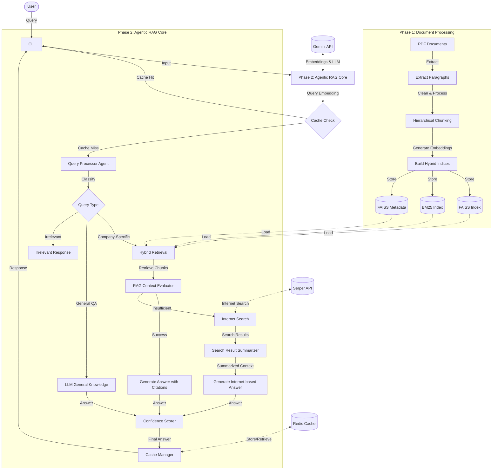

# Architecture Analysis Report

## Summary
This codebase implements a two-phase Retrieval-Augmented Generation (RAG) system with an agentic approach. Phase 1 handles data ingestion, document processing, and index building, while Phase 2 implements the core logic for query processing, retrieval, and answer generation. The system uses a hybrid retrieval approach (combining dense FAISS and sparse BM25 indices), implements a Redis-based caching layer, and integrates with Google's Gemini LLM API for various NLP tasks.

## Entry Points
- `Phase-1/phase1_build.py` → CLI entry point for Phase 1 (document processing and index building)
  - Main function: `build_pipeline()` - Orchestrates the document processing pipeline
  - CLI arguments: `--build` (build indices) or `--query` (query the built indices)
- `agentic_rag_phase2.py` → CLI entry point for Phase 2 (agentic RAG system)
  - Main function: `answer_query_agentic_with_cache()` - Orchestrates the query processing pipeline
  - CLI arguments: `--query` (run interactive query mode)

## Architectural Style
- **Layered Architecture** with clear separation of concerns:
  - Data Processing Layer (Phase 1): Document extraction, chunking, indexing
  - Core Logic Layer (Phase 2): Query classification, retrieval, answer generation
  - Caching Layer: Redis-based vector similarity caching
  - External Integration Layer: Gemini API, Serper AI API
- **Pipeline-based Processing** with sequential stages in both phases
- **Agent-based Decision Making** with multiple specialized components working together

## Architecture Diagram

## Component Responsibilities

### Phase 1: Document Processing
- **Document Extraction**: Extracts text from PDF documents using PyMuPDF
- **Text Cleaning**: Removes noise like page numbers and excessive whitespace
- **Hierarchical Chunking**: Splits documents into chunks at paragraph level with intelligent sentence boundary detection
- **Embedding Generation**: Uses Gemini API to generate embeddings for chunks
- **Index Building**: Creates FAISS (dense) and BM25 (sparse) indices for hybrid retrieval

### Phase 2: Agentic RAG Core
- **Query Classification Agent**: Determines if a query is company-specific, general knowledge, or irrelevant
- **Hybrid Retrieval**: Combines dense and sparse retrieval methods for better results
- **Context Evaluation**: Determines if retrieved context is sufficient to answer the query
- **Internet Search Fallback**: Uses Serper AI to search the internet when internal context is insufficient
- **Answer Generation**: Uses Gemini LLM to generate answers from context
- **Confidence Scoring**: Calculates confidence in generated answers
- **Caching Layer**: Uses Redis with vector similarity to cache answers for similar queries

### External Integrations
- **Gemini API**: Used for embeddings, query classification, answer generation, and summarization
- **Serper AI API**: Used for internet search fallback
- **Redis**: Used for vector similarity-based caching

## Data Flow

1. **User Query Flow**:
   - User submits query via CLI
   - System checks cache for similar queries
   - If cache miss, query is classified by agent
   - Based on classification, different processing paths are taken
   - Answer is generated, confidence is calculated, and result may be cached
   - Response is returned to user

2. **Document Processing Flow**:
   - PDF documents are loaded and processed
   - Text is extracted and cleaned
   - Documents are split into chunks
   - Chunks are embedded and indexed
   - Indices are stored for later retrieval

## Technical Characteristics

- **Embedding Model**: Google's Gemini text-embedding-004 (768 dimensions)
- **LLM Model**: Gemini 2.0 Flash for various NLP tasks
- **Hybrid Retrieval**: Combines semantic search (FAISS) and keyword search (BM25)
- **Vector Similarity**: Uses cosine similarity for cache matching and confidence scoring
- **Error Handling**: Includes retry logic for API calls and fallback mechanisms
- **Caching**: Redis-based vector similarity caching with RediSearch