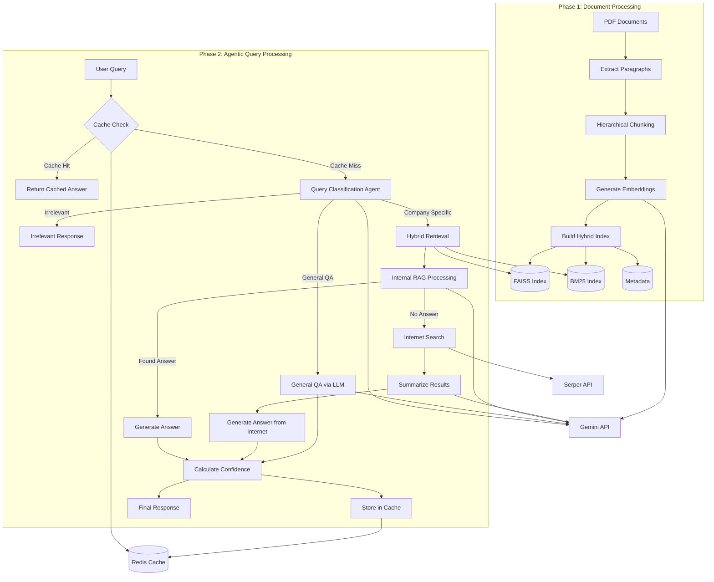

# Architecture Analysis Report

## Summary
This codebase implements a sophisticated Retrieval-Augmented Generation (RAG) system with an agentic approach, split into two distinct phases. Phase 1 focuses on data ingestion, chunking, embedding, and index building, while Phase 2 implements the intelligent decision-making agent for the Q&A system. The architecture follows a pipeline pattern with clear separation of concerns between data processing and query handling, enhanced with caching, confidence scoring, and multiple retrieval strategies.

## Entry Points
- `/Phase-1/phase1_build.py:main` → CLI entry point for building the document index
- `/agentic_rag_phase2.py:main` → CLI entry point for the interactive Q&A system

## Architectural Style
The codebase follows a **pipeline architecture** with clear stages for data processing and query handling. It also implements an **agent-based architecture** for intelligent decision-making during query processing.

Key architectural patterns:
- **Pipeline Pattern**: Sequential processing of data through well-defined stages
- **Agent-based Architecture**: Decision-making components that route queries to appropriate handlers
- **Hybrid Retrieval**: Combination of dense (FAISS) and sparse (BM25) retrieval methods
- **Cache-Aside Pattern**: Redis-based caching layer for query results
- **Fallback Strategy**: Multiple paths for answering queries with graceful degradation

## Architecture Diagram

## UI/Backend Violations
- No UI components in this codebase; it's a purely backend/CLI-based system.

## Details

### Phase 1: Document Processing

Phase 1 handles the ingestion and processing of documents:

1. **PDF Extraction**: 
   - `extract_paragraphs()` in `phase1_build.py:line 87` extracts text from PDF files using PyMuPDF.
   - Text is cleaned and split into paragraphs.

2. **Chunking Strategy**:
   - `hierarchical_chunking()` in `phase1_build.py:line 125` implements paragraph-level chunking.
   - Paragraphs are either kept intact (if under token limit) or split at sentence boundaries.

3. **Embedding Generation**:
   - `get_gemini_embeddings_batch()` in `phase1_build.py:line 186` handles batch processing of text to embeddings.
   - Includes retry logic and fallback to zero vectors for failed embedding attempts.

4. **Index Building**:
   - `build_hybrid_index()` in `phase1_build.py:line 223` creates both FAISS (dense) and BM25 (sparse) indexes.
   - Metadata is stored alongside for retrieval context.

### Phase 2: Agentic RAG System

Phase 2 implements the intelligent query processing system:

1. **Query Classification**:
   - `classify_query()` in `agentic_rag_phase2.py:line 721` determines if a query is irrelevant, general knowledge, or company-specific.
   - Uses Gemini LLM for classification decisions.

2. **Hybrid Retrieval**:
   - `hybrid_retrieval()` in `agentic_rag_phase2.py:line 168` combines FAISS and BM25 search results.
   - Normalizes and weights scores from both methods for optimal retrieval.

3. **Context Evaluation**:
   - `evaluate_and_answer()` in `agentic_rag_phase2.py:line 751` attempts to answer from retrieved internal context.
   - Returns either an answer with citations or a signal that no answer was found.

4. **Internet Search Fallback**:
   - `perform_internet_search()` in `agentic_rag_phase2.py:line 795` uses Serper API for internet searches.
   - `summarize_search_results()` in `agentic_rag_phase2.py:line 838` extracts relevant information from search results.

5. **Confidence Scoring**:
   - `calculate_confidence_score()` in `agentic_rag_phase2.py:line 308` evaluates answer quality based on semantic similarity and retrieval scores.
   - Different scoring methods depending on the path taken (RAG, internet search, general knowledge).

6. **Caching Layer**:
   - `RedisCacheManager` class in `agentic_rag_phase2.py:line 378` handles vector similarity-based caching.
   - Uses Redis with RediSearch for efficient vector similarity searches.

7. **Orchestration**:
   - `answer_query_agentic()` in `agentic_rag_phase2.py:line 882` orchestrates the entire query processing workflow.
   - `answer_query_agentic_with_cache()` in `agentic_rag_phase2.py:line 971` adds caching and confidence scoring to the main workflow.

### Key Components

1. **Environment Setup**:
   - Both phases load environment variables for API keys.
   - Phase 2 requires Phase 1 to have been executed first.

2. **LLM Integration**:
   - Gemini API is used for multiple purposes:
     - Text embeddings for vector search
     - Query classification
     - Answer generation from context
     - Internet search result summarization
     - General knowledge answers

3. **Caching Strategy**:
   - Redis with RediSearch vector database for similarity-based caching.
   - Stores query embeddings, answers, and confidence scores.
   - Uses cosine similarity threshold for cache hit determination.

4. **Decision Flow**:
   - Clear agent-based decision tree for handling different query types.
   - Multiple fallback strategies when primary answer paths fail.

The architecture demonstrates a sophisticated approach to RAG systems with multiple retrieval strategies, intelligent decision-making, confidence scoring, and caching for performance optimization.